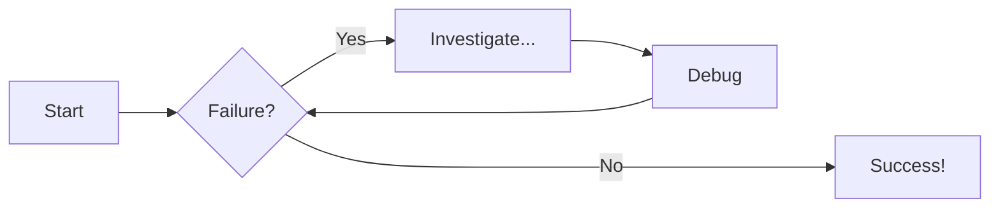
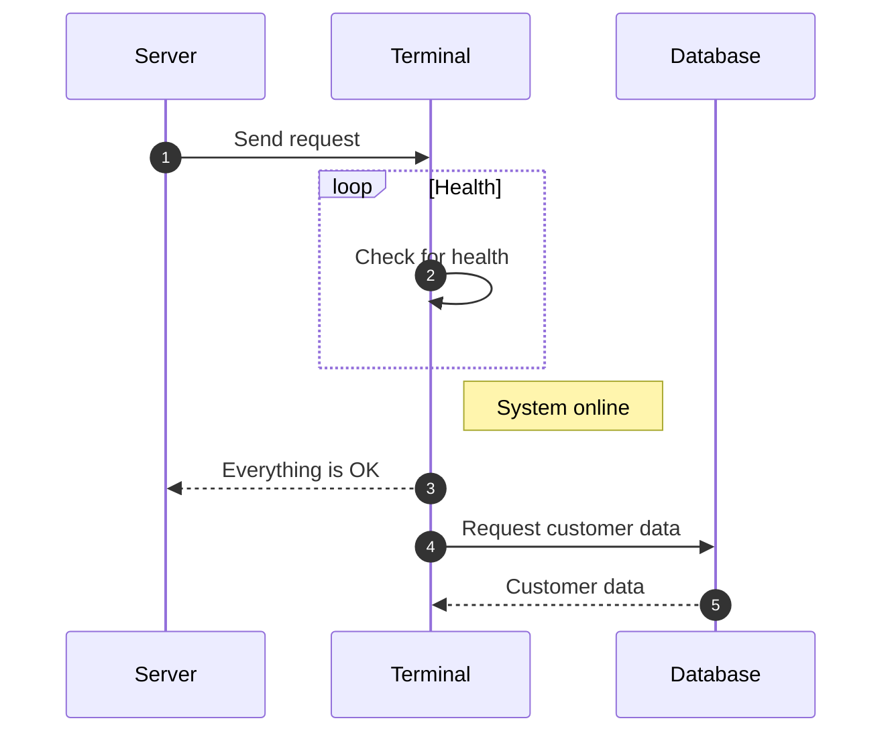

---
authors:
    - aman
---

# How to use MkDocs
[Followed tutorial](https://jameswillett.dev/getting-started-with-material-for-mkdocs){target="_blank"} by James Willett.

??? tip "Modify Page Nav"
    Modify page navigations like [here](https://github.com/squidfunk/mkdocs-material/blob/master/mkdocs.yml#L183){target="_blank"}

## Use emojis in sentences
I like to drink beers :beers: after I play soccer :soccer:

Search Icons and Emojis database [here](https://squidfunk.github.io/mkdocs-material/reference/icons-emojis/#search){target="_blank"}.

## Working with code blocks

```py title="add_numbers.py" linenums="1" hl_lines="2-3"
# Function to add two numbers
def add_two_numbers(num1, num2):
    return num1 + num2

# Example usage
result = add_two_numbers(5, 3)
print('The sum is:', result)
```

## Using content-tabs
### Code Blocks in Content Tabs

=== "Python"

    ```py
    def main():
        print("Hello world!")

    if __name__ == "__main__":
        main()
    ```

=== "JavaScript"

    ```js
    function main() {
        console.log("Hello world!");
    }

    main();
    ```

## Using admonitions
Check the [Admonitions documentation](https://squidfunk.github.io/mkdocs-material/reference/admonitions/#supported-types){target="_blank"} for other examples of admonitions you can use.

### Non-collapsible
!!! note "Title of the callout"

    Lorem ipsum dolor sit amet, consectetur adipiscing elit. Nulla et euismod
    nulla. Curabitur feugiat, tortor non consequat finibus, justo purus auctor
    massa, nec semper lorem quam in massa.

### Collapsible

??? info "Collapsible callout"

    Lorem ipsum dolor sit amet, consectetur adipiscing elit. Nulla et euismod
    nulla. Curabitur feugiat, tortor non consequat finibus, justo purus auctor
    massa, nec semper lorem quam in massa.

## Diagrams
Diagram [docs](https://squidfunk.github.io/mkdocs-material/reference/diagrams/#using-state-diagrams){target="_blank"} by squidfunk.
### Flow diagrams



## Sequence Diagrams

